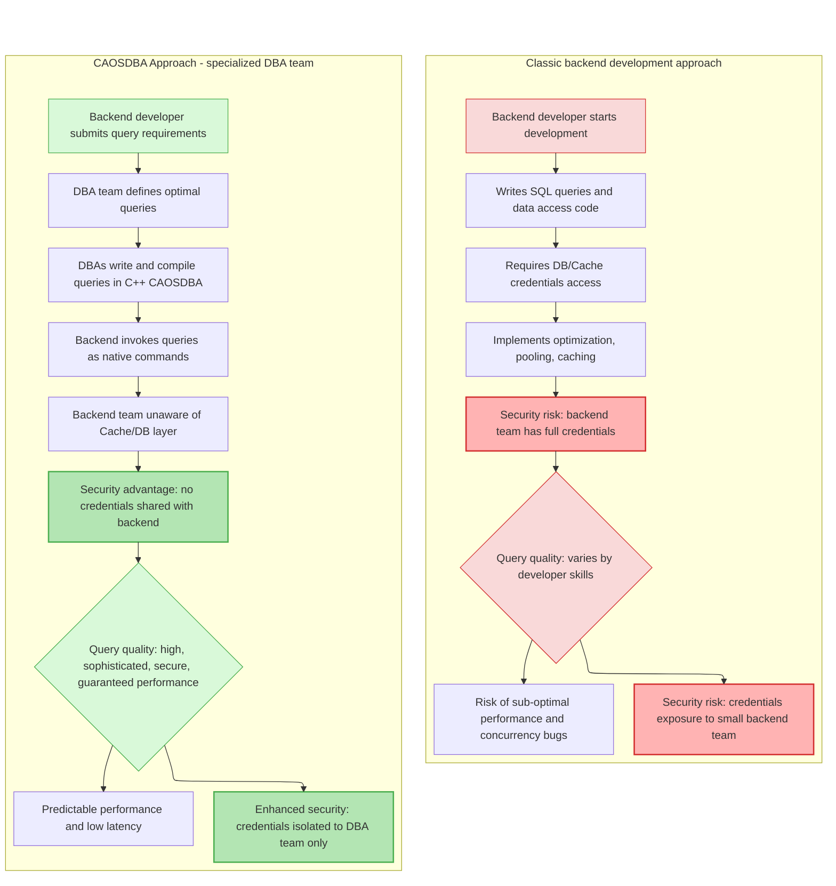

<div>


<p><b>Cache App On Steroids - High-Performance C++ backend with built-in caching</b></p>
</div>

&nbsp;

# Why CAOSDBA?

**CAOSDBA** is a high-performance C++ framework designed with a **cache-first architecture** at its core. It's particularly valuable for teams seeking **predictable low-latency** and **scalable data access patterns**.

By integrating [**CrowCpp**](https://github.com/CrowCpp/Crow) as its backend engine and exposing C++ queries as **native PHP extensions**, CAOSDBA allows teams to execute high-performance C++ code through simple PHP function calls or REST APIs.

**In essence**, CAOSDBA bridges the gap between application code and data layer optimization, making expert-level query performance accessible across your entire tech stack.

&nbsp;

# Collaborative data layer design

**Great applications are built on great data layers**—but creating optimal data access patterns requires bridging multiple areas of expertise. DBAs bring deep knowledge of query optimization and data modeling, while developers focus on application logic.

CAOSDBA helps these different experts work together effectively, ensuring that database expertise translates directly into application performance without creating silos or complexity.

## **How CAOSDBA enables team collaboration**

- **DBAs write optimized queries** in C++ with full control over execution plans and caching strategies
- **Developers access data** through native PHP/Python functions or REST APIs
- **Performance knowledge stays with experts** who understand the data layer best
- **Application code remains clean** and focused on business logic
- **Teams share ownership** of data layer performance and scalability

## **Traditional challenges vs. CAOSDBA approach**

**Traditional approach:**
```php
// Developer writes direct DB query
$result = $db->query("SELECT * FROM users WHERE id = ?", [$id]);
// Performance varies, credentials exposed
```

&nbsp;

**With CAOSDBA:**
```php
// DBA-optimized C++ query, cached automatically
$result = IQuery_GetUserById($call_context, $id);
// Guaranteed performance, secure
```

&nbsp;

| Aspect | Traditional Approach | With CAOSDBA |
| :--- | :--- | :--- |
| **Query Ownership** | Scattered across application code | Centralized with data experts |
| **Performance Consistency** | Varies by developer experience | Guaranteed by compiled C++ queries |
| **Team Collaboration** | Often reactive and siloed | Proactive and integrated |
| **Caching Strategy** | Application-focused implementation | Data-layer focused with DBA guidance |

&nbsp;

# Performance by Architectural Design

&nbsp;

## **Data access & caching:**
* **Cache-First architecture:** Every critical request is directed to **Redis** first, ensuring **sub-millisecond response times**
* **Smart caching:** Configurable **cache invalidation strategies** and distributed caching support to guarantee data freshness and consistency
* **Unified access:** A consistent and **automated API** for interacting with all persistence layers

## **Connection infrastructure (Pool Management):**
* **Automatic connection pooling:** The framework intelligently manages a **pool of connections** (to Redis and databases) to avoid resource saturation and the overhead of connection creation/destruction
* **Controlled scalability:** Allows configuration of **minimum and maximum** connection limits, enabling CAOSDBA to optimize resource utilization elastically

## **Multi-Database support:**
* **PostgreSQL:** Full ACID compliance for critical data
* **MySQL/MariaDB:** Reliable, enterprise-grade relational storage
* **Redis:** Blazing-fast in-memory caching layer

## **Web & API ready:**
* **Built-in HTTP server** via **CrowCpp** for rapid service development
* Out-of-the-box **REST API** endpoints, ideal for **microservices** and **API Gateways**
* **Native PHP/Python exports** - call C++ queries directly as PHP/Python functions

&nbsp;

# Architecture & Technology

## **Architectural benefits:**
* **Reduced Database Load:** Smart caching can **cut direct DB queries by up to 90%**
* **Improved Data Consistency:** Robust invalidation and synchronization mechanisms
* **Developer Productivity:** Consistent and reusable data layer patterns
* **Flexible Deployment:** Supports single instances and distributed clusters


## Overview



&nbsp;

# Ideal For

* **High-Traffic web applications:** Efficient handling of thousands of concurrent users
* **Near Real-Time data processing:** **Low-latency** data ingestion and processing
* **Microservices ecosystems:** Incredibly fast inter-service communication
* **API Gateways:** Accelerating API responses and offloading DB load
* **E-commerce/Gaming:** High-performance product catalogs and leaderboards
* **Data-Intensive backends:** Services requiring efficient processing of large datasets like ERP, WMS or CRM

&nbsp;

# Supported Technologies:

| Category | Technologies |
| :--- | :--- |
| **Persistence** | PostgreSQL, MySQL, MariaDB |
| **Caching** | Redis |
| **Web/REST** | CrowCpp (HTTP/JSON) - PHP/Python native extension |
| **Language** | C++17+ |
| **Platform** | Linux |
| **Build System** | CMake |

&nbsp;

# Prerequisites

- C++17 or later
- CMake 3.15+
- Linux OS
- PHP 8.0+ (for PHP bindings)
- Python 3.6+ (for Python bindings)

&nbsp;

# Getting Started

**Install dependencies (Debian/Ubuntu):**

```bash
sudo apt-get update
sudo apt-get install libfmt-dev libspdlog-dev libhiredis-dev

# For MySQL support
sudo apt-get install libmysqlclient-dev libmysqlcppconn-dev

# For MariaDB support
sudo apt-get install libmariadb-dev

# PHP bindings
sudo apt-get install php-dev

# Python bindings
sudo apt-get install python3-dev
```

**Clone repository from GitHub with submodules:**

```bash
git clone --recurse-submodules https://github.com/mydevhero/CAOSDBA.git

# Change to project directory
cd CAOSDBA
```

&nbsp;

# Configure project

Currently CAOSDBA provides support for PHP and Python language bindings or CrowCpp backend.

&nbsp;

## Project type
The flag `CAOS_PROJECT_TYPE` defines which kind of project to create.

&nbsp;

## Language binding
- `CAOS_PROJECT_TYPE=BINDING`

If you choose `BINDING` as `CAOS_PROJECT_TYPE`, then you have to choose which language to bind to using the `CAOS_BINDING_LANGUAGE` flag:
- `CAOS_BINDING_LANGUAGE=PHP`
- `CAOS_BINDING_LANGUAGE=PYTHON`

Compiling PHP binding requires PHP module development:
```bash
sudo apt-get install php-dev
```

Compiling Python binding requires Python module development:
```bash
sudo apt-get install python3-dev
```

&nbsp;

## CrowCpp
- `CAOS_PROJECT_TYPE=CROWCPP`

If you choose `CAOS_PROJECT_TYPE=CROWCPP`, then you have to choose which kind of support you want by defining the `CAOS_CROWCPP_TYPE` flag:
- `CAOS_CROWCPP_TYPE=ENDPOINT` 
- `CAOS_CROWCPP_TYPE=MIDDLEWARE`

&nbsp;

## Database
The flag `CAOS_DB_BACKEND` can be set to one of the three databases currently supported:
- `CAOS_DB_BACKEND=MARIADB`
- `CAOS_DB_BACKEND=MYSQL`
- `CAOS_DB_BACKEND=POSTGRESQL` 

&nbsp;

# Examples

&nbsp;

## PHP binding with MySQL backend

```bash
cmake -G Ninja -DCAOS_DB_BACKEND=MYSQL -DCAOS_PROJECT_TYPE=BINDING -DCAOS_BINDING_LANGUAGE=PHP ../../
```

## Python binding with MySQL backend

```bash
cmake -G Ninja -DCAOS_DB_BACKEND=MYSQL -DCAOS_PROJECT_TYPE=BINDING -DCAOS_BINDING_LANGUAGE=PYTHON ../../
```

### CrowCpp backend on PostgreSQL
```bash
cmake -G Ninja -DCAOS_DB_BACKEND=POSTGRESQL -DCAOS_PROJECT_TYPE=CROWCPP -DCAOS_CROWCPP_TYPE=MIDDLEWARE ../../
```

&nbsp;

# Defining queries

Look into `query_definitions.txt`, which looks like:
```txt
######################################################################################################################################################
# return_type              | method_name                | full_params     | call_params  | authType | authName      | authKey                        #
######################################################################################################################################################
std::optional<std::string> | IQuery_Template_echoString | std::string str | str          | TOKEN    |CAOS_API_TOKEN | ARBJi7cJuOYPXmFPPLVWsGrXmD4SU3LW
```

This is the source of the queries boilerplate, avoiding the need to define each query in both base class and forward classes.
Just define your query as shown in the example code.

**Column descriptions:**
- `return_type`: C++ return type (e.g., `std::optional<std::string>`, `int`, `bool`)
- `method_name`: Function name that will be generated
- `full_params`: Complete parameter list with types
- `call_params`: Parameter names for the function call
- `authType`: Authentication type (TOKEN for shared environments)
- `authName`: Environment variable name for the token
- `authKey`: The actual authentication key value

TOKENs provide secure access control in shared environments like PHP/Python, ensuring only authorized code can execute queries.

&nbsp;

# Build
```bash
cmake --build .
```

&nbsp;

# Environment variables used by CAOS

CAOSDBA requires these environment variables to be set before running:

### Redis

```bash
export CAOS_CACHEHOST="localhost"
export CAOS_CACHEPORT=6379
export CAOS_CACHEPASS=""
```

### Database

```bash
export CAOS_DBHOST="localhost"
export CAOS_DBPORT=3306 # 5432
export CAOS_DBUSER="..."
export CAOS_DBPASS="..."
export CAOS_DBNAME="..."
```

### TOKENs

Export each TOKEN as defined in `query_definitions.txt`:

```bash
export CAOS_API_TOKEN=ARBJi7cJuOYPXmFPPLVWsGrXmD4SU3LW
```

&nbsp;

# First try

NOTE: library is called "my_app", like the PROJECT_NAME in CMakeLists.txt

```bash
# PHP
php -d extension=./my_app.so -r 'print_r(IQuery_Template_echoString(["token" => "ARBJi7cJuOYPXmFPPLVWsGrXmD4SU3LW"], "Hello CAOS!"));'

# Python
python3 -c "import my_app; print(my_app.IQuery_Template_echoString({'token':'ARBJi7cJuOYPXmFPPLVWsGrXmD4SU3LW'}, 'Hello CAOS!'))"

# Node.js
node -e "const caos = require('./node_22/my_app');const result = caos.IQuery_Template_echoString({}, 'Hello CAOS!');console.log(result);"
```

&nbsp;

# Prepare to release your CAOSDBA app

```bash
sudo cmake --build . --target make_distribution_tarball
```

&nbsp;

## Multiple Projects Support

This system supports multiple CAOSDBA-based projects installed simultaneously on the same system. Each project has its own isolated repository:

```text
/opt/caosdba/
├── repositories/
│ ├── my_app/ # First project repository
│ ├── my_app2/ # Second project repository
│ └── another_app/ # Third project repository
└── install-repository.sh
```

### Deb package features:

- **Isolated repositories**: Each project maintains its own APT repository
- **No conflicts**: Projects don't interfere with each other
- **Parallel installation**: Install multiple projects side-by-side
- **Independent updates**: Update each project independently

### How It Works:

1. **Project-specific paths**: Each project's repository is stored in `/opt/caosdba/repositories/<project_name>/`
2. **APT source isolation**: Each project configures its own APT source file
3. **Package namespacing**: Packages include the project name (e.g., `my_app-python-postgresql-3.12`)

### Installation workflow:

```bash
cd build/release

# Install first project
sudo tar -xzf my_app-python-deb-repository-postgresql-1.0.0+1.tar.gz -C /
sudo /opt/caosdba/install-repository.sh

# Both projects are now available via APT
sudo apt install my-app-python-postgresql
```

&nbsp;

# Clean project

During the initial CMake configuration, CAOS sets up the project by copying and creating necessary files. If you need to start from scratch (e.g., after major configuration changes or to resolve build issues), you can clean the project using the following steps.

&nbsp;

## ⚠️ Warning

The purge operation **deletes files irreversibly**, including:
- The `build/release` directory
- Configuration files in `cmake/`
- The entire `src/` directory

Make sure you have committed or backed up any important changes before proceeding.

&nbsp;

## Cleanup commands

```bash
# Remove the build directory
rm -rf build/release

# Purge generated configuration files (deletes files in cmake/ and src/!)
./bin/caosdba.sh --purge
```

&nbsp;

## What happens after cleaning

After running these commands, you'll need to:

- Re-run CMake configuration
- Rebuild the project from scratch

&nbsp;

# Contributing

Contributions are welcome! Please feel free to submit a Pull Request.

&nbsp;

# Show your support

If you find CAOSDBA useful, please consider giving it a star on GitHub!
