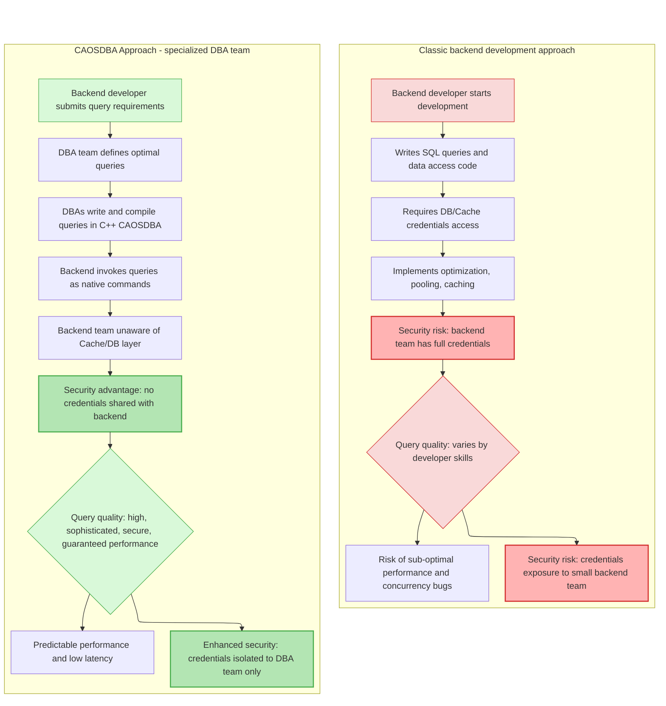

<div>


<p><b>Cache App On Steroids - High-Performance C++ backend with built-in caching</b></p>
</div>

&nbsp;

## Why CAOSDBA?

**CAOSDBA** (**C**ache-**A**pp-**O**n-**S**teroids for **D**ata**b**ase **A**rchitects), also referred to as **CAOS**, is a high-performance C++ framework that makes caching your **primary data layer**. Built for DBAs who need **predictable low-latency** and **zero-downtime scalability**. Designed for systems where caching isn't an optimization—it's the **foundational component**.

It integrates [**CrowCpp**](https://github.com/CrowCpp/Crow) as its backend engine and exposes C++ queries as **native PHP extensions**. Execute high-performance C++ code seamlessly through standard PHP function calls.

**In summary**, CAOSDBA is a high-level engineering solution that combines the efficiency of C++ with the Cache-First pattern, ensuring that data layer performance is driven by DBA expertise and is easily accessible from application environments like PHP or REST Microservices.

&nbsp;

## Quick Example

**Traditional approach:**
```php
// Developer writes direct DB query
$result = $db->query("SELECT * FROM users WHERE id = ?", [$id]);
// Performance varies, credentials exposed
```

**With CAOSDBA:**
```php
// DBA-optimized C++ query, cached automatically
$result = IQuery_GetUserById($token, $id);
// Guaranteed performance, secure
```

&nbsp;

## 👑 Designed for Database Experts

**Database performance starts with proper query design**—something DBAs master daily. While backend developers excel at application logic, DBAs own the data layer expertise.

### **The reality CAOSDBA solves:**
- **DBAs** write optimal queries but can't always enforce their usage in application code
- **Developers** may lack deep SQL tuning expertise for complex data patterns
- **Performance gaps** emerge when query logic lives far from database expertise

### **The approach:**
- **Query ownership** stays with DBA teams where it belongs
- **C++ compiled queries** ensure optimal execution plans every time
- **CrowCpp or PHP simple interfaces** let developers call expert-level queries safely
- **No more "query degradation"** between DBA specs and implementation

&nbsp;

## ⚡ Performance by Architectural Design

### **Data access & caching:**
* **Cache-First architecture:** Every critical request is directed to **Redis** first, ensuring **sub-millisecond response times**
* **Smart caching:** Configurable **cache invalidation strategies** and distributed caching support to guarantee data freshness and consistency
* **Unified access:** A consistent and **automated API** for interacting with all persistence layers

### **Connection infrastructure (Pool Management):**
* **Automatic connection pooling:** The framework intelligently manages a **pool of connections** (to Redis and databases) to avoid resource saturation and the overhead of connection creation/destruction
* **Controlled scalability:** Allows configuration of **minimum and maximum** connection limits, enabling CAOSDBA to optimize resource utilization elastically

### **Multi-Database support:**
* **PostgreSQL:** Full ACID compliance for critical data
* **MySQL/MariaDB:** Reliable, enterprise-grade relational storage
* **Redis:** Blazing-fast in-memory caching layer

### **Web & API ready:**
* **Built-in HTTP server** via **CrowCpp** for rapid service development
* Out-of-the-box **REST API** endpoints, ideal for **microservices** and **API Gateways**
* **Native PHP exports** - call C++ queries directly as PHP functions

&nbsp;

## 🧠 Architecture & Technology

### **Architectural benefits:**
* **Reduced Database Load:** Smart caching can **cut direct DB queries by up to 90%**
* **Improved Data Consistency:** Robust invalidation and synchronization mechanisms
* **Developer Productivity:** Consistent and reusable data layer patterns
* **Flexible Deployment:** Supports single instances and distributed clusters

### Overview



&nbsp;

## 🎯 Ideal For

* **High-Traffic web applications:** Efficient handling of thousands of concurrent users
* **Near Real-Time data processing:** **Low-latency** data ingestion and processing
* **Microservices ecosystems:** Incredibly fast inter-service communication
* **API Gateways:** Accelerating API responses and offloading DB load
* **E-commerce/Gaming:** High-performance product catalogs and leaderboards
* **Data-Intensive backends:** Services requiring efficient processing of large datasets like ERP, WMS or CRM

### **Supported Technologies:**
| Category | Technologies |
| :--- | :--- |
| **Persistence** | PostgreSQL, MySQL, MariaDB |
| **Caching** | Redis |
| **Web/REST** | CrowCpp (HTTP/JSON) - PHP native extension |
| **Language** | C++17+ |
| **Platform** | Linux |
| **Build System** | CMake |

&nbsp;

### **Prerequisites**
- C++17 or later
- CMake 3.15+
- Linux OS
- PHP 8.0+ (for PHP bindings)

# Getting Started

Clone the repository into a local directory:
```bash
# Install dependencies (Debian/Ubuntu)
sudo apt-get update
sudo apt-get install libfmt-dev libspdlog-dev libhiredis-dev

# For MySQL support
sudo apt-get install libmysqlclient-dev libmysqlcppconn-dev

# For MariaDB support
sudo apt-get install libmariadb-dev

# Clone repository from GitHub with submodules
git clone --recurse-submodules https://github.com/mydevhero/CAOSDBA.git

# Change to project directory
cd CAOSDBA
```

# Configure Project

Currently CAOSDBA provides support for PHP language bindings or CrowCpp backend.

## Project Type
The flag `CAOS_PROJECT_TYPE` defines which kind of project to create.

### Language Binding
- `CAOS_PROJECT_TYPE=BINDING`

If you choose `BINDING` as `CAOS_PROJECT_TYPE`, then you have to choose which language to bind to using the `CAOS_BINDING_LANGUAGE` flag:
- `CAOS_BINDING_LANGUAGE=PHP`

Compiling PHP binding requires PHP module development:
```bash
sudo apt-get install php-dev
```

### CrowCpp Endpoints
- `CAOS_PROJECT_TYPE=CROWCPP`

If you choose `CAOS_PROJECT_TYPE=CROWCPP`, then you have to choose which kind of support you want by defining the `CAOS_CROWCPP_TYPE` flag:
- `CAOS_CROWCPP_TYPE=ENDPOINT` 
- `CAOS_CROWCPP_TYPE=MIDDLEWARE`

## Database
The flag `CAOS_DB_BACKEND` can be set to one of the three databases currently supported:
- `CAOS_DB_BACKEND=MARIADB`
- `CAOS_DB_BACKEND=MYSQL`
- `CAOS_DB_BACKEND=POSTGRESQL` 

# Examples

### PHP binding with MySQL backend

```bash
cmake -G Ninja -DCAOS_DB_BACKEND=MYSQL -DCAOS_PROJECT_TYPE=BINDING -DCAOS_BINDING_LANGUAGE=PHP ../../
```

### CrowCpp backend on PostgreSQL
```bash
cmake -G Ninja -DCAOS_DB_BACKEND=POSTGRESQL -DCAOS_PROJECT_TYPE=CROWCPP -DCAOS_CROWCPP_TYPE=MIDDLEWARE ../../
```

# Defining Queries

Look into `query_definitions.txt`, which looks like:
```txt
######################################################################################################################################################
# return_type              | method_name                | full_params     | call_params  | authType | authName      | authKey                        #
######################################################################################################################################################
std::optional<std::string> | IQuery_Template_echoString | std::string str | str          | TOKEN    |CAOS_API_TOKEN | ARBJi7cJuOYPXmFPPLVWsGrXmD4SU3LW
```

This is the source of the queries boilerplate, avoiding the need to define each query in both base class and forward classes.
Just define your query as shown in the example code.

**Column descriptions:**
- `return_type`: C++ return type (e.g., `std::optional<std::string>`, `int`, `bool`)
- `method_name`: Function name that will be generated
- `full_params`: Complete parameter list with types
- `call_params`: Parameter names for the function call
- `authType`: Authentication type (TOKEN for shared environments)
- `authName`: Environment variable name for the token
- `authKey`: The actual authentication key value

TOKENs provide secure access control in shared environments like PHP, ensuring only authorized code can execute queries.

# Build
```bash
cmake --build .
```

# Environment Variables Used by CAOS

CAOSDBA requires these environment variables to be set before running:

### Redis

```bash
export CAOS_CACHEHOST="localhost"
export CAOS_CACHEPORT=6379
export CAOS_CACHEPASS=""
```

### Database

```bash
export CAOS_DBHOST="localhost"
export CAOS_DBPORT=3306 # 5432
export CAOS_DBUSER="..."
export CAOS_DBPASS="..."
export CAOS_DBNAME="..."
```

### TOKENs

Export each TOKEN as defined in `query_definitions.txt`:

```bash
export CAOS_API_TOKEN=ARBJi7cJuOYPXmFPPLVWsGrXmD4SU3LW
```

# First Try

NOTE: library is called "my_app", like the PROJECT_NAME in CMakeLists.txt

```bash
php -d extension=./my_app.so -r 'print_r(IQuery_Template_echoString("ARBJi7cJuOYPXmFPPLVWsGrXmD4SU3LW","test"));'
```

# Prepare to release Your CAOSDBA App

NOTE: target prepends "my_app", like the PROJECT_NAME in CMakeLists.txt

```bash
sudo cmake --build . --target my_app_distribution_tarball
```

Find the tarball in the `dist` directory and extract:

NOTE: tarball prepends "my_app", like the PROJECT_NAME in CMakeLists.txt

```bash
sudo tar -xzf dist/my-app-deb-repository-postgresql-1.0.0+1.tar.gz -C /
```

Now you have in `/opt/caosdba` all you need to install into the system:

```bash
sudo /opt/caosdba/install-repository.sh
```

There you'll find deb packages for a regular installation on Debian/Ubuntu:

NOTE: package prepends "my_app", like the PROJECT_NAME in CMakeLists.txt

```bash
sudo apt search my-app-php-postgresql

# Install
sudo apt install my-app-php-postgresql
```

Once the app is installed, you can try the example query by typing:
```bash
php -r 'print_r(IQuery_Template_echoString("ARBJi7cJuOYPXmFPPLVWsGrXmD4SU3LW","test"));'
```

## 🤝 Contributing

Contributions are welcome! Please feel free to submit a Pull Request.

## ⭐ Show your support

If you find CAOSDBA useful, please consider giving it a star on GitHub!
